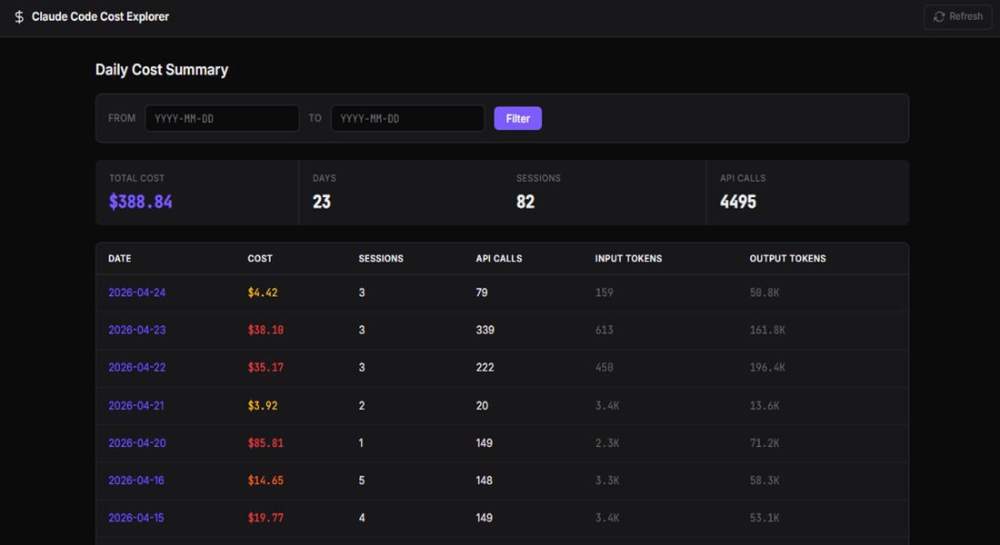

# Claude Code Cost Explorer

A local Flask web app for exploring Claude Code usage by day, session, and turn.
It reads Claude Code JSONL logs from your machine, summarizes token usage, and
estimates API cost without sending data anywhere.

No API key is needed. No database is used. No frontend build step is required.

## What It Shows

Drill down: **Day → Session → Turn**

- 💬 Conversation turns → full messages + collapsible thinking
- 🛠️ Tool calls → `[tool: Bash]`, `[3 tools: Read, Write, Glob]` → inputs + raw output

At each level it shows cost and token summaries. Turn detail pages can show the
full user message, assistant content blocks, collapsible thinking blocks when
present in the source log, and tool call inputs/results.

| Home | Sessions | Detail |
|------|----------|--------|
|  |  |  |

## Install

```bash
pip install claude-code-cost-explorer
```

## Run

```bash
ccx
```

Then open:

```text
http://localhost:5050
```

You can also choose a port:

```bash
ccx --port 5051
```

## Requirements

- Python 3.10 or newer
- Claude Code installed and used at least once
- A local `~/.claude/projects/` directory containing Claude Code session JSONL
  files

## How It Works

Claude Code Cost Explorer scans:

```text
~/.claude/projects/*/*.jsonl
```

For each valid session file, it parses assistant records with token usage,
associates them with the preceding user prompt or tool result, estimates cost
from the model pricing table, and renders the result through local Flask/Jinja
pages.


## Session Naming Tips

Session titles come from Claude Code session metadata. Deliberate names make the
session list much easier to scan when comparing costs across similar work.

| How | When |
| --- | --- |
| `claude -n "my-feature"` | At startup |
| `/rename my-feature` | During a conversation |
| Press `R` in the `/resume` picker | After the fact |

If you do not name a session, Claude assigns a random slug.

## Development

```bash
uv run pytest -q
uv run ruff check .
uv run ruff format .
```

The project intentionally stays small: Flask, standard Python modules, Jinja
templates, and tests.

## License

MIT
